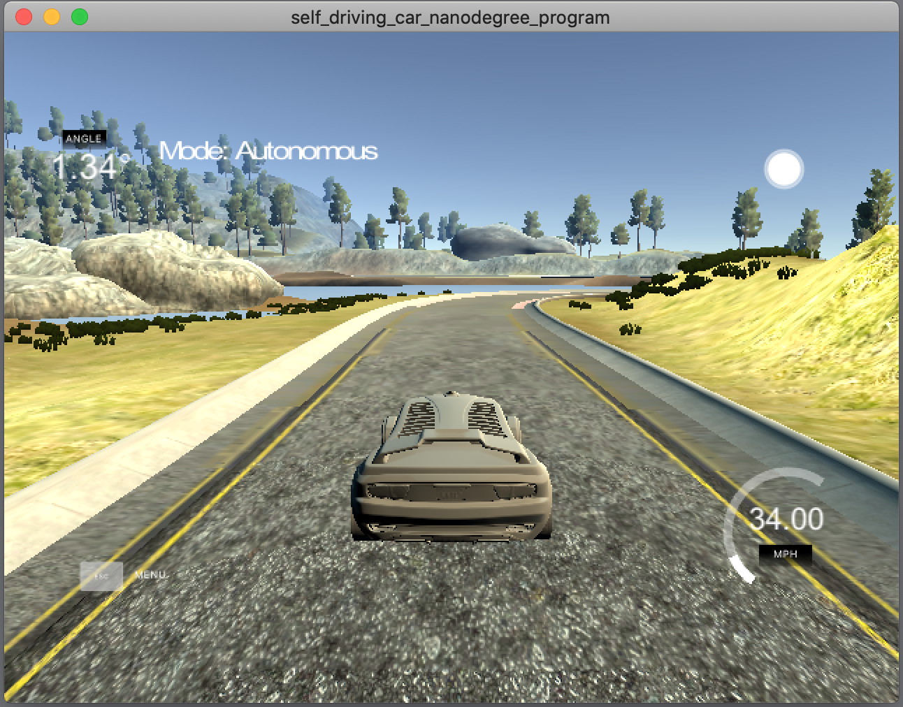
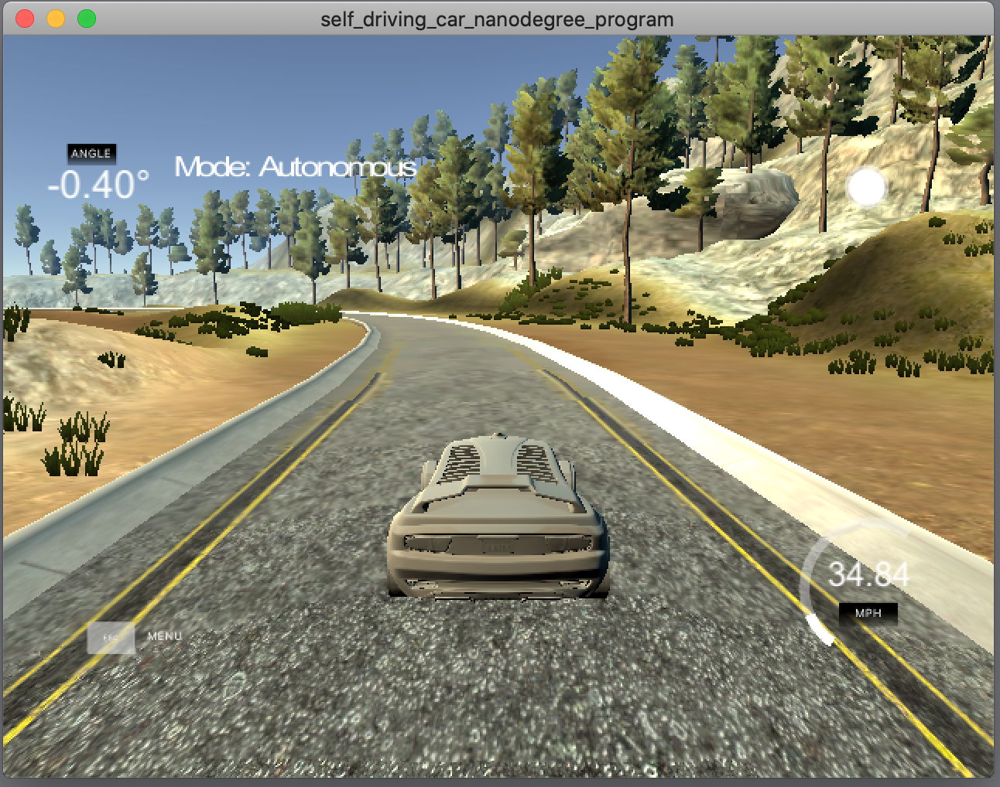

# CarND-Controls-PID
This project is a part of:  
 

## Project description

The purpose of this project is to build PID controller for car moving in simulator. The code controlls angle of steering in order to stay in the center of the lane. Only information it uses to calculate steeing is an real-time error telling how far off the center ot the line car is at every moment.

## Basic Build Instructions

1. Clone this repo.
2. Make a build directory: `mkdir build && cd build`
3. Compile: `cmake .. && make`
4. Run it: `./pid`. 

## Running the simulator

The project is using [Term 2 Simulator](https://github.com/udacity/self-driving-car-sim/releases) from Udacity. Run it along with the code binary and watch the result. It should look like:

## Solution description

Solution implemented classic PID controller where three components are involved in calculating steering angle.

**P component** handles proportion of the steeing angle depending on the cross track error (CTE; off-center of the lane error).  

**D complment** handles differential part of the equation. It counteracts tendency to overshoot the center line and oscilate left and right.

**I component** handles integral part of the equation. If there exist a bias in the system integral compoment will address the shift from the center.

At every step:  
**P** *= CTE*  
**D** *= CTE - last_CTE*  
**K** *= last_K + CTE*  

The final euation if equal to: 

*steering_angle* = *Kp* * **P** + *Kd* * **D** + *Ki* * **I**   

where *Ki*, *Kd*, *Ki* are parameters that has to be optimized in order to minimize desired overall error of the system. The optimization process used is described below.

## Parameters vs behaviour

**P component** - it decides how fast the car will make a turn. Big value without the right corresponding D compoment will cause high oscillation. Too low value will casue the car will not turn fast enough.

**D complment** - For the chosen P component it counteracts oscillation. Too high havue will cause to much attention to staying neer the center and the steering will change agressively just to stay right in the center.

**I component** - Simulator did not introduce any bias so initial tart with very small value in the end ended at 0. Bad value for the system will cause the cas goes off track.

## Optimization
The optimization started from setting parameters close to the ones from original lecture:  

**Kp:0.2 Kd:3.0, Ki:0.0001**

*The simulation was showing some oscillation*

As a first step Twiddle algorightm was implemented. The initial idea wat to go 500 iterations at each twiddle run and then change next parameter corresponding to the algorithm.
Chosen error metric was set to Mean Squared Error od CTE.

The problems appeared that during the search for some bar values of parameters car was going off the track ant the simulator needed to be restarted. Since the automation of this process was not trivial couple of manual runs were done using 'human supervision'.

*The visual effects did not improve much*

Next step was to initially decrease deltas for twiddle algorithm to prevent choosing very differnt values to keep the car stable; also the number of iterations was changed to about 6000 which was close to one lap.

After 16 laps parameters changed to :  
**Kp 0.232878, Kd:3.74842, Ki:0.000100122**

Next, validation of best result found was introduced with reset of twiddle algorithm. The previous soludion was very unstable and the result found depended too much on moment of start. To validate the best result after some arbitraty chosen times of run the twiddle best value was reset and re-calculation of error was done.

After 300 steps with 400 iterations the result changed to :
**Kp: 0.241336, Kd:3.94704, Ki:0.000115009**

*Visually there was still oscilation visible*

Next step was to remove manually bias since the results were sugessting that there is no bias in the system.

*The result was very similar to previous one, removing bias was considered as a good move*.

Then gradient descent of the error was implemented and was running while car was driving. Each 1000 steps algoright was improving the parameters. After 10 laps the result values were equal to :  

**Kp: 0.185304, Kd:3.90704, Ki:0.0**

*and visually it improved the oscillation issues much.*

## Output video
The result from simulation can be viewed here:

## Discussion

The main issue of PID algorith is that it does not look ahead and the changes in lane vary much so it cannot easyli find the perfect solution that would not incorporate side jerks.

Solutions like Reinforcement Learning on visual frame could improve the results drastically. 

Also having detected the line borders before the car could also be used to look more ahead of the car and calculate better results.